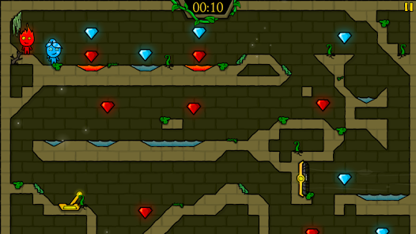

# **GDD Juegos en Red**

# **Práctica 1**

# **El Enigma de la Torre Encantada**

REALIZADO POR:

PAULA ORTIZ FERNÁNDEZ  
DANIEL CORBACHO ANES  
ALEJANDRO HERNÁNDEZ RUIZ  
ÁNGEL BERMÚDEZ FARIÑAS

# **Índice**

* **[1.Introducción	](#1introducción)**

  * [Título](#título)

  * [Género](#género)

  * [Plataforma](#plataforma)

  * [Público objetivo](#público-objetivo)

  * [Descripción \- Sinopsis](#descripción---sinopsis)

* **[2\. Imagen y Diseño Visual](#2-imagen-y-diseño-visual)**

  * [Descripción, Estilo Visual y Aspectos técnicos](#descripción-estilo-visual-y-aspectos-técnicos)

  * [Bocetos](#bocetos)

  * [Logotipo](#logotipo)

  * [Inspiración y Referencias](#inspiración-y-referencias)

* **[3\. Sonido	](#3-sonido)**

  * [Música	](#música)

  * [Efectos de sonido	](#efectos-de-sonido)

* **[4\. Jugabilidad	](#4-jugabilidad)**

  * [Objetivo del juego	](#objetivo-del-juego)

  * [Mecánicas principales](#mecánicas-principales)

  * [Mecánicas secundarias](#mecánicas-secundarias)

  * [Progresión y Logros](#progresión-y-logros)

  * [Físicas](#físicas)

  * [Escenarios](#escenarios)

    * [Piso 1: El Corredor de los Interruptores](#piso-1-el-corredor-de-los-interruptores)

    * [Piso 2: El Laboratorio del Caldero](#piso-2-el-laboratorio-del-caldero)

    * [Piso 3: La Cámara de los Ritmos](#piso-3-la-cámara-de-los-ritmos)

  * [Controles](#controles)

  * [Interfaz](#interfaz)

  * [Objetos Interactivos / Mejoras](#objetos-interactivos--mejoras)

* **[5\. Narrativa](#5-narrativa)**

  * [Sinopsis del mundo y trama](#sinopsis-del-mundo-y-trama)

  * [Desarrollo de personajes](#desarrollo-de-personajes)

  * [Personajes principales](#personajes-principales)

  * [Estructura narrativa](#estructura-narrativa)

  * [Contexto / ambientación](#contexto--ambientación)

* **[6.Diagrama de Flujo y Prototipo](#6diagrama-de-flujo-y-prototipo)**

* **[7\. Comunicación y Marketing	](#7-comunicación-y-marketing)**

* **[8\. Bibliografía	](#8-bibliografía)**
  
# **1.Introducción** 

## **Título** 

El título de nuestro juego es: El Enigma de la Torre Encantada.

## **Género** 

Juego de plataformas colaborativo con puzzles.

## **Plataforma** 

El juego estará disponible para ordenador y móviles.

## **Público objetivo** 

Este juego va dirigido a todos aquellos jugadores mayores de 7 años (PEGI 7\)  con amigos que quieran vivir aventuras alucinantes buscando el elixir de la vida. 

## **Descripción \- Sinopsis** 

¿Deseas la vida eterna? adéntrate con tus amigos en este juego multijugador colaborativo donde encarnaréis a magos de diferentes partes del mundo para adquirir el elixir de la Vida Eterna dentro de la Torre Encantada superando distintos tipos de enigmas. ¿Traición?¿Amistad? Tú eliges.

---

# **2\. Imagen y Diseño Visual** 

## **Descripción, Estilo Visual y Aspectos técnicos** 

El estilo visual de este videojuego se tratará de un juego de contrastes. Para ello, todos los elementos estarán en colores de la escala de grises, y aquellos objetos importantes y personajes estarán rodeados por un halo de luz de distintos colores para conseguir el contraste y llamada de atención deseados.    
Asimismo, se seguirá una estética cartoon, generando un ambiente amigable para el jugador. Además, será un juego 2D con una cámara fija, es decir, la pantalla mostrará en todo momento el nivel al completo, pudiendo ver todos los enigmas escondidos en el mapa. 

## **Bocetos** 

Se han creado unos cuantos bocetos, incluso se ha comenzado con un posible diseño final, en el que se muestran algunos escenarios o pruebas del juego:   
Boceto nivel 2:

Boceto prueba: a través de pistas en las paredes y las instrucciones de los libros, deberán encontrar la solución al problema:

Arco nivel 1: el nivel 1 estará compuesto por arcos de este estilo con antorchas y palancas 

## **Logotipo** 

A la hora de diseñar el logotipo, se ha querido representar los aspectos clave del videojuego: dos magos, una torre y un elixir en la cima. Con esto, cualquier usuario que lo vea puede entender un poco de qué va el juego. 

## **Inspiración y Referencias**  

El concepto de este juego surgió como la idea de un juego cooperativo, en el cúal se tuviesen que ayudar varios usuarios para lograr un objetivo común. Para ello se pensó en juegos como “Pico Park” o “Fireboy and Watergirl”. 

En cuanto a la inspiración de mecánicas, se ha decidido usar algunas parecidas a las del juego mencionado “Pico Park”, como pueden ser la colocación y diseño de puertas, botones y llaves.   
En cuanto al juego “Fireboy and Watergirl”, la inspiración principal es en el fondo del escenario, ya que una pared blanca no es adecuada para la ambientación del propio juego, sino un fondo que se asemeje al de una torre de la época medieval, que es donde se desarrolla la historia del juego. Para esta inspiración, se han buscado algunas imágenes de internet, así como imágenes, escenarios e historias fruto de la imaginación.  
Además, se han utilizado referencias de la Edad Media para el apartado tanto artístico, como para desarrollar la historia, ya que este juego transcurrirá en esta época, una época sin tecnologías y llena de magia. 

---

# **3\. Sonido** 

## **Música**  

El juego contará con una banda sonora que introduzca al jugador dentro del mundo de ficción y en la situación del mago. Para ello, habrá un hilo musical en todo momento con tonos enigmáticos y épicos que de frenetismo al juego.

## **Efectos de sonido** 

* **Personaje:**   
  * Efecto de salto  
  * Grito al caer desde muy alto  
  * Recibir daño  
* **Escenario:**   
  * Pulsación de botones  
  * Puerta al abrir o cerrar  
  * Conseguir un objeto  
  * Conseguir un logro

Gracias a estos sonidos, se conseguirá que el jugador llegue a un estado de inmersión aún mayor, y que por ello, disfrute aún más de su aventura en la torre.   
---

# **4\. Jugabilidad** 

## **Objetivo del juego** 

El objetivo de ambos jugadores es colaborar en las diferentes pruebas que se irán encontrando en las salas de la torre, para así poder alcanzar “el elixir de la vida eterna”, cada jugador deberá ayudar en las resoluciones de las pruebas para que logren ir descifrando cada enigma y llegar hasta el final. 

## **Mecánicas principales**  
* Movimiento: Salto, caminar (izq, derecha), agacharse.  
* Resolución de puzzles: interactuar con los elementos para superar las pruebas.  
* Compartir vidas: el jugador con más vida podrá darle parte de su vida a su compañero si este la necesita, pudiendo llegar a resucitar si su compañero falleció

## **Mecánicas secundarias** 

* Interacción con el entorno: dan acceso a otra zona, o un objeto clave con el cual poder avanzar en la historia. Al interactuar con esas zonas del entorno, se desbloqueará un minijuego, ya sea un puzzle, un acertijo…,   
* Gestión de objetos: el jugador llevará consigo los objetos obtenidos, y en caso de morir, el objeto permanecerá en el sitio donde el jugador haya muerto y este deberá volver para recogerlo y llevarlo a su destino.  
* Hechizos: usar magia para obtener distintos beneficios.

## **Progresión y Logros** 

El videojuego consta de tres niveles diferentes con una dificultad progresiva, donde cada nivel representa un piso distinto de la torre. A lo largo del juego, el usuario podrá ir consiguiendo los siguientes logros:

* *La vida eterna*: completa el juego  
* *Magia blanca*: comparte la poción con tu amigo  
* *Magia negra*: traiciona a tu compañero y bébete tu solo la poción  
* *Alohomora*: abre la puerta del laberinto  
* *Sanación*: utiliza el hechizo de sanación y comparte vida con tu amigo  
* *Resurrección*: revive a tu compañero con la acción de compartir vida  
* *Amistad*: Completa 1 nivel con la ayuda de tu compañero  
* *Amistad+*: Completa 2 niveles con la ayuda de tu compañero

## **Físicas**

Las físicas de El Enigma de la Torre Encantada son las siguientes:

* Movimiento de los personajes (esto también incluye salto)(Ver [Mecánicas principales](#mecánicas-principales)).  
* Interacción con el entorno: (Ver [Objetos Interactivos / PowerUps](#objetos-interactivos--mejoras))  
  * Puertas  
  * Cofres  
  * Llaves  
  * Pócimas  
  * Trampas  
  * Pulsación de botones.  
* Movimiento de los objetos de las diferentes pruebas.
* Daño: en el escenario habrá distintos objetos y trampas, así como el orden incorrecto al seguir una secuencia de pasos, que podrán quitar vida a los personajes
  
## **Escenarios** 
El escenario de este juego se tratará de la “Torre Encantada”. Esta se dividirá en cuatro pisos, tres de ellos serán los niveles jugables por los usuarios dónde se encuentren las pruebas y acertijos, y el último se trata de la cima de la torre, dónde se encuentra el deseado elixir. 

### **Piso 1: El Corredor de los Interruptores** 
Al entrar, los aprendices se encuentran en una sala que se extiende como un pasillo de piedra antigua, con columnas que sostienen antorchas que iluminan el lugar, así como un interruptor. Al final del pasillo se encuentran unas escaleras protegidas por un campo de fuerza. Para poder seguir a la siguiente sala, deben desactivar el campo de fuerza que les impide subir, pulsando para ello los interruptores en el orden correcto. Este orden en el que deben activarse está oculto en las inscripciones de las paredes. Algunas pistas son directas, otras requieren deducción, como “el segundo va antes que el cuarto” o “el primero es el número tres”. Por último, en una zona más oscura se encontrarán dos interruptores que se deben activar al mismo tiempo, obligando a los jugadores a coordinarse. Si se equivocan, las antorchas se apagarán durante unos segundos, y los jugadores deberán comenzar de nuevo. Además, deberán tener cuidado ya que la sala estará repleta de trampas que les impidan seguir hacia delante.

### **Piso 2: El Laboratorio del Caldero** 

Al subir las escaleras, los magos entran a una sala decorada con estanterías llenas de frascos brillantes, ingredientes mágicos y libros antiguos abiertos sobre una mesa de madera. En el centro, un gran caldero burbujea con energía dorada, esperando la mezcla correcta. Al final de la sala, se encuentra una puerta cerrada con un candado, y sobre una estantería una llave que parece encajar. El problema, no llegan a recoger la llave. Los aprendices tienen acceso a varios ingredientes mágicos, como agua luminosa, plumas de fénix, sal encantada, piedra de sombra, esencia de luz, y deben combinarlos en grupos de tres para crear los elixires de aumentar y disminuir su tamaño y poder alcanzar la llave. Además, habrá pistas por la sala que les sugieren que elixires deben hacer y por donde deben ir. Para crearlos, deberán entender los libros de magia que se encuentran en la sala, así como darse cuenta de que los pergaminos que cuelgan de las paredes les darán pistas. Si se mezclan ingredientes incorrectos, el caldero se vacía, se reinicia y uno de los dos magos perderá algo de vida. Si aciertan, el líquido se vuelve dorado y la sala se ilumina por completo. Este laboratorio pone a prueba la deducción, la observación y la colaboración, y solo quienes se comuniquen bien y actúen en sincronía podrán avanzar.

### **Piso 3: La Cámara de los Ritmos** 

El último piso se trata de una sala circular iluminada por cristales mágicos que emiten destellos rítmicos de luz de colores. En el centro, unos cristales de mayor tamaño marcan secuencias luminosas que deben ser memorizadas y repetidas con precisión. A un lado, una piedra rúnica reproduce sonidos mágicos (campanas, tambores, ecos, etc) que los aprendices deben imitar pulsando botones al mismo ritmo. Más adelante, una puerta con símbolos numéricos bloquea el paso, y solo se abrirá si los magos introducen correctamente la secuencia. Todo en la sala está diseñado para poner a prueba la coordinación, la memoria y la atención compartida, y representa el último paso antes de alcanzar el elixir de la vida eterna.

Una vez los magos han superado cada una de las pruebas de las salas de la torre, llegarán a la cima. Este se trata de un escenario al aire libre, rodeado de almenas que protegen la cima de la torre, así como un campo de fuerza que impide que alguien llegue a aquella cima sin haber superado las pruebas. En el centro se encuentra un pilar sobre el que flota el frasco del elixir de la vida eterna. Los jugadores deberán llegar hasta él y decidir si seguirán el camino de la magia negra o no. 

## **Controles** 
El videojuego consta del sistema WASD para el movimiento de su personaje: 

* A para el movimiento a la izquierda  
* D para el movimiento a la derecha  
* S para agacharse  
* ESPACIO para el salto

Así mismo, si se desea jugar el juego en la opción local, es decir, en el mismo dispositivo, la alternativa para jugar dos jugadores es uno, el ya citado anteriormente, y el otro jugador con las flechas del teclado:  

* FLECHA IZQUIERDA para ir a la izquierda   
* FLECHA DERECHA para ir a la derecha  
* FLECHA ABAJO para agacharse   
* FLECHA ARRIBA para saltar 

## **Interfaz** 
Cada jugador dispondrá de una cantidad de tres vidas, pudiendo transferirse entre ellos si hiciera falta. Las vidas aparecerán en la pantalla en la posición arriba a la izquierda y derecha, según sea un personaje u otro.   
En la recolección de objetos, no se dispondrá de un inventario físico, sino que el objeto aparecerá debajo de las vidas, a modo de recordatorio de su posesión.  
Por otro lado, se dispondrá del menú de pausa del juego donde podrás cambiar los ajustes del mismo como el brillo del juego, el volumen de la música, la opción de salir de la partida o de continuar con ella.

## **Objetos Interactivos / Mejoras** 

A lo largo de todo el juego, los magos deberán ir superando distintos tipos de puzzles y acertijos, para los cuales tendrán que conseguir objetos y hechizos:

* Llave: algunas puertas y cofres de las salas se encontrarán cerradas, y para poder abrirlas deberán encontrar la llave escondida.  
* Aumento de tamaño: algunos objetos están demasiado altos, y el mago no consigue alcanzarlos. Para ello, deberán usar un hechizo que aumente su tamaño para poder llegar.  
* Disminución de tamaño: en la sala hay recovecos muy pequeños que esconden distintos enigmas, pero los magos no pueden acceder a ellos. Para ello, deberán usar un hechizo que disminuya su tamaño y puedan pasar por lugares pequeños y estrechos sin ningún problema.  
* Placas de presión: para poder activar estas placas, será necesario de la colaboración de ambos jugadores y accionar su mecanismo a la vez.   
* Interruptores: en la sala habrá múltiples interruptores que deberán pulsar en el orden correcto para poder avanzar.  
* Pociones: los jugadores deberán encontrar los ingredientes necesarios para crear la poción que necesitan.  
* Cristales luminosos: brillarán a un ritmo que servirá a los magos para abrir una puerta.  
* Trampas: a lo largo del mapa habrá trampas que deberán evitar. De lo contrario, los magos perderán parte de su vida. 

---

# **5\. Narrativa** 
## **Sinopsis del mundo y trama** 

Después de años de entrenamiento, por fin ha llegado el momento en el que aquellos magos por fin iban a conseguir ser magos de verdad. Llevaban mucho tiempo preparándose y estudiando para este momento, y por fin van a recibir aquel elixir deseado por todo mago,“el elixir de la vida eterna”.  Sin embargo, no será sencillo, aún deberán demostrar por última vez que están hechos para obtener esta gran virtud. 

La tradición cuenta que para conseguir ser un verdadero mago será necesario conseguir por ellos mismos este elixir adentrándose en la Torre Encantada, demostrando que son merecedores del título de mago eterno y que poseen las habilidades necesarias. La más importante, la colaboración, puesto que por uno solo no siempre se puede llegar al lugar deseado.

Por este motivo, los jóvenes aprendices que deseen ascender, se adentrarán en aquella vieja torre, y atravesarán, una a una, sus salas hasta llegar arriba del todo, dónde se encuentra el elixir que tanto desean. En cada sala se encontrarán con numerosos obstáculos que deberán sobrepasar demostrando sus habilidades obtenidas durante todos estos años de esfuerzo.

## **Desarrollo de personajes** 
Los jóvenes magos llegarán a la torre sin apenas conocer al resto de aspirantes e incluso sin conocerse del todo a ellos mismos. Conforme van avanzando su camino, irán descubriendo cualidades y trucos que no sabían que conocían. 

Además, poco a poco los magos decidirán qué camino quieren llevar, si el camino de la magia blanca, o el camino de la magia negra. La torre y sus retos tratarán de persuadir a los aprendices para ir por el camino oscuro, y quedará en sus manos ver por el bien de su amigo, o solo por el suyo. 

## **Personajes principales**  

En esta aventura, los jugadores podrán seleccionar entre dos tipos de magos:

* **Mago de Luz:** procedente de una pequeña tribu de magos de la región montañosa del norte, este mago fue expulsado de su aldea por interesarse por la magia de la sombra.  
* **Mago de Sombra:** procedente de la ciudad de las tinieblas del este, este mago decidió abandonar su hogar en busca de conocimientos sobre otras artes mágicas, destacando la magia de la luz.

Ambos magos se conocerán en una taberna de la ciudad del aire, preguntando el mago de la sombra por un mago que le acompañe en su expedición en busca del elixir, siendo el mago de luz el único que acepte esta gran aventura. 

## **Estructura narrativa**  
La historia sigue una estructura lineal con pequeñas ramificaciones morales.  
A medida que los jugadores avanzan por las distintas salas de la torre, la narrativa se desarrolla de forma progresiva y coherente, vinculando los retos con la evolución de los personajes. Sin embargo, las decisiones y acciones de los jugadores (como compartir vida, salvar o traicionar a su compañero) pueden alterar el desenlace final, derivando en diferentes conclusiones:

* **Final de la Magia Blanca:** ambos magos colaboran y comparten el elixir, alcanzando la vida eterna juntos.  
* **Final de la Magia Negra:** uno de los magos traiciona al otro, quedándose con el elixir y condenando a su compañero.

De este modo, la historia mantiene una base lineal en su desarrollo, pero ofrece ramificaciones en función de las decisiones de los jugadores, reforzando el componente cooperativo y moral.

## **Contexto / ambientación** 
La historia se desarrolla en un mundo mágico y antiguo donde la existencia de la magia es fundamental para la vida. En este mundo, los magos estudian durante años para alcanzar el máximo reconocimiento: obtener el elixir de la vida eterna.

En el centro de este mundo se alza la Torre Encantada, una construcción legendaria creada hace siglos por los antiguos magos. Se dice que en su cima se guarda el elixir, protegido por innumerables pruebas que ponen a prueba el valor, la sabiduría y, sobre todo, la colaboración.

El interior de la torre está dividido en varias salas, cada una con su propia ambientación. Estas han sido explicadas anteriormente en el apartado de [Escenarios](#escenarios).

El ambiente general del juego mantiene una estética oscura y misteriosa, con colores en escala de grises y toques de luz mágica que marcan los objetos y personajes importantes. 
---

# **6.Diagrama de Flujo y Prototipo**

A continuación se presenta un diagrama de flujo en el que se muestra el esquema que seguirá el juego, así como un prototipo de las futuras interfaces.   

---

# **7\. Comunicación y Marketing** 

¿Quieres llegar a lo alto de la torre Encantada junto a tus amigos? lánzate en este juego multijugador de puzzles donde arriba solo te espera la verdad y la amistad o la traición. 

Con esta estrategia, se pretenderá llevar a cabo la campaña de Marketing para publicitar “El Enigma de la Torre Encantada”, un juego dirigido a mayores de 7 años que disfruten de los retos en equipo y las historias con finales alternativos.

Para ello, se irá promocionando a través de las redes sociales, poco a poco, publicando en las cuentas oficiales de Instagram, TikTok, Twitter y YouTube contenidos del juego como trailers, clips cortos del juego, ilustraciones conceptuales, personajes, escenarios, objetos, incluso algún boceto. Con estas publicaciones “rápidas” se pretende tener un gran alcance y llegar a mucha más gente que con solo la publicación del juego.

Además, el juego no será muy difícil de obtener, ya que se podrá encontrar el enlace para descargarlo y jugarlo en cualquiera de sus cuentas de las redes sociales. Por otra parte, para que sea sencillo y evitar problemas, se podrá encontrar en múltiples plataformas. 

Por último, para llegar a un mayor rango de personas y que comprendan mejor el juego, se subirán vídeos y se realizarán directos en plataformas como YouTube o Twitch  dónde se juegue este videojuego. Para ello, se harán colaboraciones con grandes influencers del mundo de los videojuegos, así como con pequeños creadores, asistiendo también a eventos y ferias de videojuegos para dar a conocer el juego a aquellos que están buscando nuevas ideas.  

---

# **8\. Bibliografía** 

Toda la historia, personajes, mecánicas, arte y, en general todo el contenido de este documento ha sido fruto de la imaginación de los integrantes del equipo siguiendo la rúbrica y especificaciones del enunciado de la práctica. 

* Los dibujos se han realizado usando: <a href="https://www.clipstudio.net/es/?gad_source=1&gad_campaignid=16152707213&gbraid=0AAAAADy1cQnNcCCgB9czulc02MgTCoyO7&gclid=Cj0KCQjw9czHBhCyARIsAFZlN8QWLZmwXPloxo9gdc2wwsykfjXo1cb7ZaZOJurup7FkNUqMbMHlJvUaAkOGEALw_wcB" title="Clip Studio Paint"> Clip Studio Paint</a> 
* El diagrama de flujo se ha realizado usando:<a href="https://app.diagrams.net/" title="Draw.io"> Draw.io </a>
* Los prototipos se han realizado con: <a href="https://www.figma.com/files/team/1361365474905584726/recents-and-sharing" title="Figma"> Figma </a>
